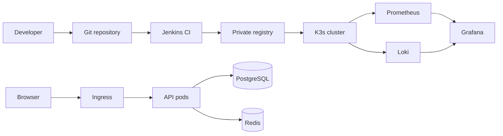

# DevOps Home Lab: de cero a una plataforma observable

Laboratorio práctico para construir, automatizar, desplegar, observar y reparar una aplicación. El proyecto toma como punto de partida el recorrido conceptual del *DevOps Home Lab Handbook* de Veriqta, pero lo convierte en una implementación reproducible y original.

> Estado: material educativo. No expongas Jenkins, Grafana, Prometheus, el registro ni Kubernetes directamente a Internet.

## Resultado final

Al terminar tendrás:

- tres servidores Ubuntu administrados por SSH y Ansible;
- una aplicación web con API, PostgreSQL y Redis;
- imágenes versionadas en un registro privado;
- CI con Jenkins: pruebas, análisis básico, build y publicación;
- un clúster K3s con Ingress, ConfigMap, Secret, probes, límites y rollback;
- métricas con Prometheus y Grafana y logs centralizados con Loki;
- ejercicios de fallo y un método repetible de diagnóstico.



## Ruta recomendada

| Fase | Tema | Resultado verificable |
|---|---|---|
| 0 | [Diseño y requisitos](docs/00-arquitectura.md) | arquitectura, red y decisiones documentadas |
| 1 | [Linux, SSH y red](docs/01-linux-red.md) | tres nodos accesibles y endurecidos |
| 2 | [Git y aplicación](docs/02-git-aplicacion.md) | aplicación probada y versionada |
| 3 | [Docker y Compose](docs/03-docker-compose.md) | stack local saludable y persistente |
| 4 | [Ansible](docs/04-ansible.md) | configuración idempotente de nodos |
| 5 | [Jenkins CI](docs/05-jenkins-ci.md) | imagen probada, etiquetada y publicada |
| 6 | [Kubernetes](docs/06-kubernetes.md) | aplicación desplegada con Ingress y rollback |
| 7 | [Observabilidad](docs/07-observabilidad.md) | métricas, dashboards y logs consultables |
| 8 | [Fallos y recuperación](docs/08-fallos.md) | runbook ejercitado con evidencia |
| 9 | [Publicación](docs/09-publicacion.md) | repositorio y serie de blog listos |

No avances por “haber ejecutado comandos”. Avanza cuando cumplas la sección **Criterio de salida** de cada fase.

## Dos perfiles de despliegue

**Compacto (recomendado para aprender):** una estación con 8 vCPU, 16 GB RAM y 100 GB libres; tres VM pequeñas o tres equipos existentes. Los componentes de observabilidad pueden compartir nodos.

**Completo:** 8-16 vCPU, 32 GB RAM y 200 GB SSD; tres VM con 2 vCPU/4 GB cada una y la estación de control con 4 vCPU/8 GB. Este perfil soporta Jenkins y observabilidad con más comodidad.

La guía usa esta red de ejemplo; cámbiala sin dejar direcciones mezcladas:

| Host | IP | Función |
|---|---:|---|
| `control.lab` | `192.168.56.10` | Ansible, Jenkins y registro |
| `worker1.lab` | `192.168.56.11` | K3s server |
| `worker2.lab` | `192.168.56.12` | K3s agent |

## Inicio rápido

1. Clona tu copia y crea una rama: `git switch -c feat/lab-bootstrap`.
2. Lee `docs/00-arquitectura.md` y define tu inventario real.
3. Configura los nodos con `docs/01-linux-red.md`.
4. Valida la aplicación local: `docker compose up --build`.
5. Continúa en orden; cada capítulo incluye validación y diagnóstico.

## Convenciones de seguridad

- Nunca confirmes `.env`, kubeconfigs, claves SSH, tokens o contraseñas.
- Usa secretos de Jenkins y Kubernetes; los valores del repositorio son ejemplos no productivos.
- Limita los puertos a la red privada del laboratorio.
- Usa imágenes con versión; evita `latest` en despliegues reproducibles.
- Destruir y reconstruir es parte del laboratorio, pero respalda datos antes de practicar fallos.

## Estructura

```text
.
├── ansible/                 # inventario y configuración declarativa
├── app/                     # API de ejemplo y pruebas
├── docs/                    # implementación paso a paso
├── jenkins/Jenkinsfile      # pipeline como código
├── k8s/                     # manifiestos Kubernetes
├── monitoring/              # Prometheus y datasource Grafana
├── scripts/verify.sh        # comprobaciones de extremo a extremo
└── docker-compose.yml       # entorno local
```

## Licencia y atribución

El texto y el código de este repositorio son una implementación educativa original. La secuencia temática fue inspirada por el PDF *DevOps Home Lab Handbook* de Veriqta. Las marcas citadas pertenecen a sus respectivos propietarios. Revisa la licencia del material fuente antes de reutilizar capturas, logotipos o diagramas; este repositorio no los redistribuye.

